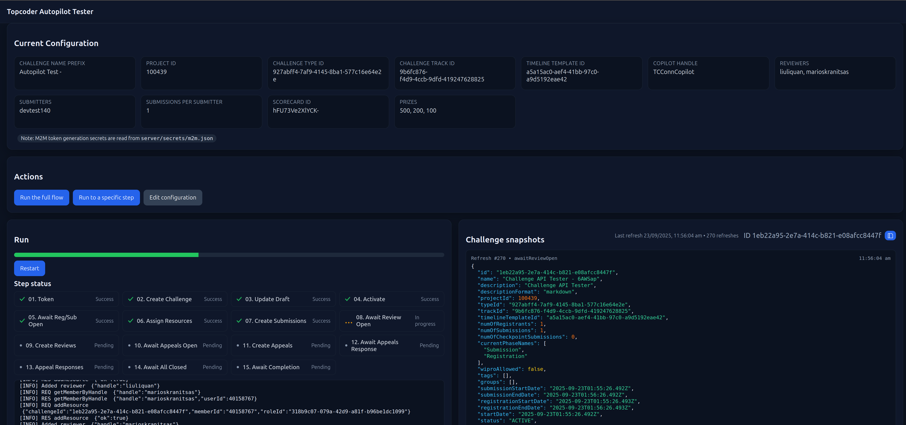

# Topcoder Autopilot Tester

A Node.js + TypeScript web app that automates and validates the autopilot service flow for Topcoder’s v6 APIs.  The app creates, runs, and monitors a challenge end-to-end, while providing a GUI for configuration, progress tracking, and live logs.

The challenge is created using a timeline template that has 1 minute phases for:  registration, submission, review, appeals, and appeals response.  Registration and submission will be scheduled to open immediately and close at the same time.

## Screenshot



## Setup

### Install dependencies

```bash
pnpm install
pnpm run install:all
```


Copy the sample file:

```bash
cp server/secrets/m2m.sample.json server/secrets/m2m.json
```
Edit `m2m.json` with your Client ID and Client Secret:

```json
{
  "tokenUrl": "https://topcoder-dev.auth0.com/oauth/token",
  "audience": "https://m2m.topcoder-dev.com/",
  "clientId": "YOUR_CLIENT_ID",
  "clientSecret": "YOUR_CLIENT_SECRET"
}
```

**This file is ignored by git and must never be committed.**

```bash
pnpm run dev
```

- Server: http://localhost:5055  
- Client: http://localhost:5173 (proxies `/api/*` to the server)

## Features

- **Configuration Management**
  - Set challenge name prefix, project ID, type/track, timeline template, prize settings, copilot/reviewer/submitter handles.

- **Flow Execution**
  - Full challenge lifecycle steps:
    1. Generate M2M token
    2. Create → Draft → Activate challenge
    3. Monitor Registration** & Submission phases
    4. Assign copilot, reviewers, and submitters
    5. Add submissions
    6. Wait for phases → Review → Appeals → Appeals Response
    7. Auto-generate reviews with randomized answers/comments
    8. Create appeals & randomized responses
    9. Track phase transitions (with 15s grace tolerance)
    10. Verify challenge completion & winner assignment
  - **Run full flow** or **stop at a chosen step**.

- **Available Flows**
  - Full Challenge
  - First2Finish
  - Topgear Task
  - Topgear Task (Late)
  - Design Challenge

- **Persistence**
  - Saves challenge ID, submission IDs, review IDs, and appeal IDs to `server/data/last-run.json` for reuse/debugging.

- **UI**
  - Config display & editor
  - Run actions:
    - Run full flow
    - Run to a specific step
  - Live progress bar
  - Streaming log viewer with request/response details

### Edit Configuration

- Navigate to the UI and click _Edit configuration_.
- Select challenge type, track, scorecard, set handles, submissions count, and prize settings.
- Save to persist into `server/data/config.json`.

### Run the Flow

- **Run full flow** → executes all steps.
- **Run to step** → stops after the selected step (useful for testing Autopilot at specific phases).
- Progress and logs stream live in the UI.

### Persistence

After a run, `server/data/last-run.json` contains:

```json
{
  "challengeId": "abc123",
  "submissions": {
    "submitter1": ["sub1", "sub2"]
  },
  "reviews": {
    "reviewer1:submitter1:sub1": "reviewId"
  },
  "appeals": ["appealId1", "appealId2"]
}
```

This helps with debugging, replaying, or continuing partial runs.
